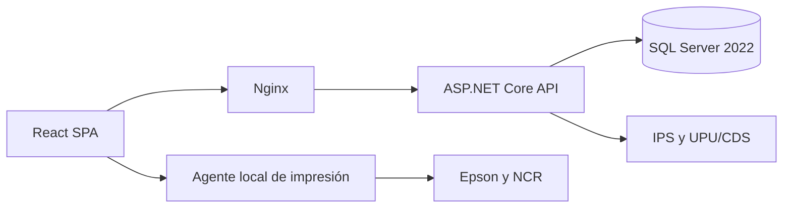

# Arquitectura objetivo

## Flujo principal

## Responsabilidades

### Domain

Contiene entidades, objetos de valor, estados y reglas que no dependen de HTTP, EF Core ni interfaces gráficas.

### Application

Contiene los casos de uso, validaciones de aplicación, DTO y contratos de persistencia e integraciones.

### Infrastructure

Implementa EF Core, repositorios, JWT, PBKDF2, auditoría, mensajería y adaptadores de servicios externos.

### API

Expone recursos REST versionados, autorización, validación de entrada, manejo uniforme de errores y OpenAPI.

### Frontend

Presenta las operaciones según permisos. No contiene cálculos financieros ni reglas críticas de negocio; estas permanecen en la API.

## Decisiones iniciales

- Arquitectura de monolito modular. COTELNET no necesita comenzar como microservicios.
- Un único despliegue de API con módulos internos claramente separados.
- Transacciones en la capa de aplicación/infraestructura para ventas, caja, inventario y transferencias.
- Fechas almacenadas en UTC y mostradas en la zona horaria de Panamá.
- Operaciones sensibles idempotentes para impedir ventas o pagos duplicados.
- Auditoría de usuario, estafeta, terminal, fecha, operación y valores relevantes.
- Secretos únicamente en variables de entorno o en el gestor de secretos del despliegue.

## Límites importantes

Docker ejecutará el frontend, la API y los servicios del servidor. La comunicación COM/USB con las impresoras no debe implementarse dentro del navegador ni de un contenedor Linux. Se diseñará un agente firmado para Windows que acepte trabajos autorizados y limitados.

